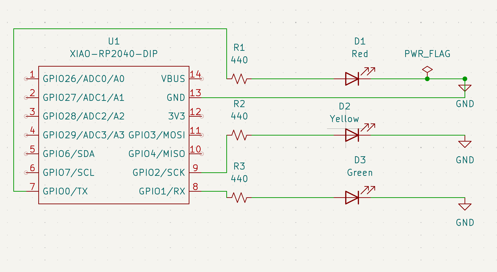
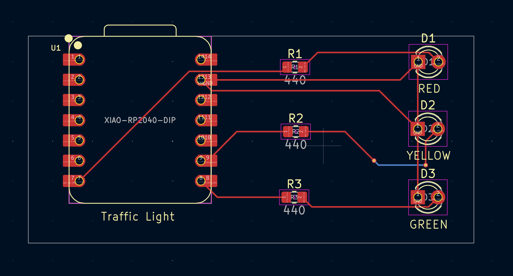
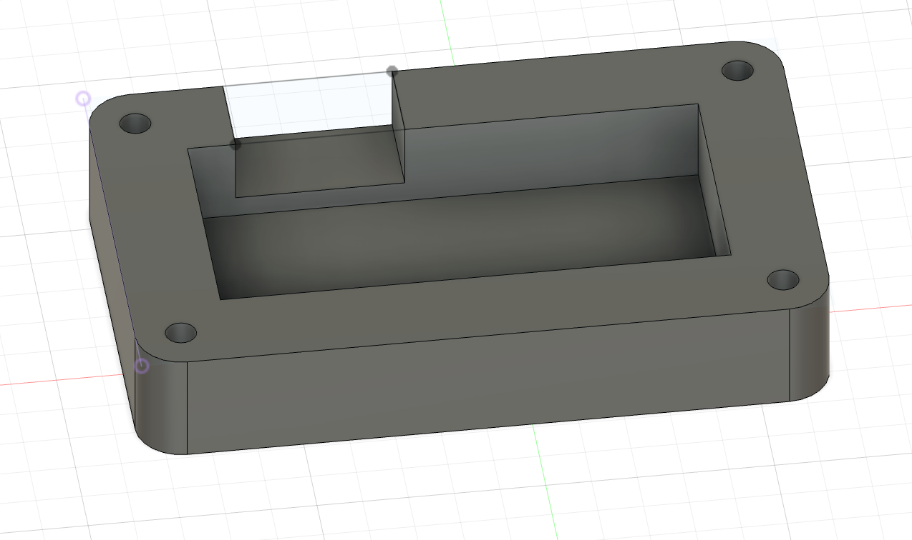
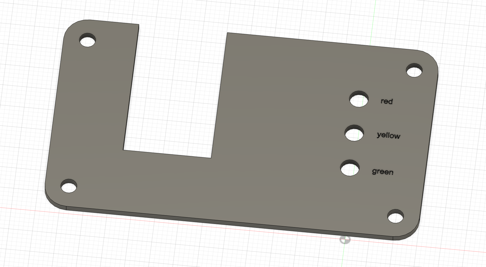
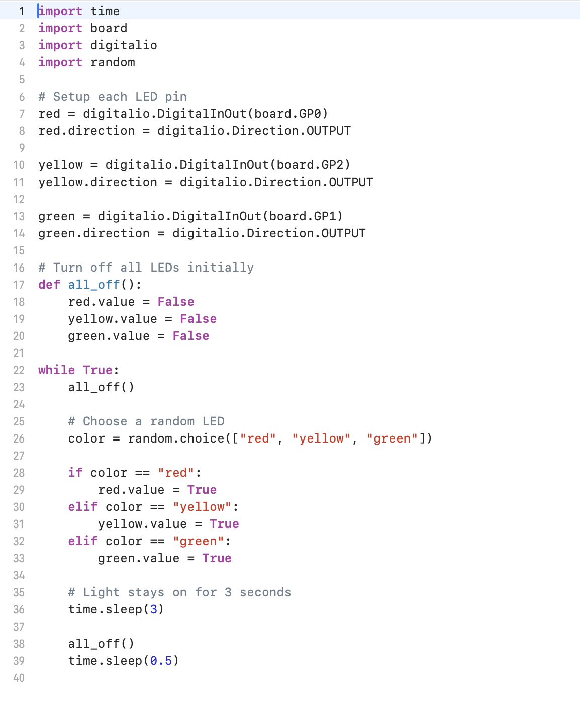

TOTAL TIME: 9 hrs

# June 20th: Day 1: Started the TrafficLight project
Today I started my first custom project—a traffic light PCB! I already did the Hackpad project so I wanted to use something I was familiar with. 

I started my schematic by adding:
    - A XIAO RP2040 (I changed from Raspberry Pi to try something new),
    - 3 LEDs (Red, Yellow, Green), and
    - 3 resistors (440Ω) to limit current.
    - power flag and gnds

Each LED is connected to a GPIO pin to act like a real traffic light: red → green → yellow. I labeled the LED colors even though I used a generic white LED symbol in KiCad—I’ll solder the real red/yellow/green ones when building the board. I wasn't sure if what I was doing was right so I watched a lot of youtube videos to give me an idea of what I should be doing. The deisgn rule checker also made sure there were no errors. 

Mistake #1:
I forgot to include the XIAO library when creating the project, so the symbols didn’t show up. I had to delete the whole schematic and start over. I already had the library downloaded, I just forgot the steps to include it in the project (like the packpad). I eventually fixed it and continued with my work.

Time spent: 2hrs

Image: 

# June 21th: Day 2: Finished the PCB layout
Honestly, this part was pretty smooth. The steps were similair to the Hackpad macropad project I did before. Only 3 LEDs, one resistor per LED, and the XIAO RP2040. I first positioned everything to the way i wanted it. Then I connected everything, and I also used a via. I added the word "Traffic Light" as well. When I ran the design rule checker, it only have the silkscreen errors which is also what I encountered when doing the Hackpad project so I hope that is okay.

Time spent: 1hr

Image: 

# June 22nd: Day 3: Case day
This was the part I was most nervous about because it’s very different from the Hackpad project. 

I started with the bottom case. I measured my pcb, made 4 holes, extruded the edges, and made a spot of the usbc port. For the top part I followed the top part dimensions and adding the led holes.

Mistake #2:
When making the bottom case, I used the exact board dimensions and then SUBTRACTED 20mm so I can make the edges extrude. Before I made the cut out for the usbc port I realized that my case was soooo small. Then I realized I made a big mistake and I was supposed to ADD 20mm. I redid everything slowly making sure I don't make any silly mistakes like that.

Mistake #3:
For the LED cutouts in the top case, I misaligned the holes. In the PCB editor, I measured the LED spacing by the edge of the part, but in Fusion 360, I was placing the holes using the center point. That small difference completely messed up the alignment. When I previewed it, the LEDs looked uneven and crooked. It took me a while to figure out that my reference point was the issue. I went back, measured again using the center-to-center distance, and fixed it.

Total time spent: 3hrs

Image: 

# June 23rd: Day 4: Touch ups + Code + Submitting! aka last day
Today was all about polishing and coding. I’m way more comfortable writing code than designing PCBs or Fusion cases, so this part went pretty smoothly. I went back into Fusion 360 and made a few final changes to the case:
    - Rounded the edges of the top and bottom parts to make it look cleaner and more finished.
    - Added text labels for each LED: red, yellow, and green

I wrote the full code today Here’s what the code does:
- Sets up GPIO pins for red, yellow, and green LEDs.
- Defines a function that turns all LEDs off (like a reset).
- In a loop, it picks a random color and lights up that LED for 3 seconds.
- After that, it turns everything off briefly and repeats.

The goal was to simulate a random traffic light sequence, kind of like a basic prototype for unpredictable light patterns (like testing hardware responses or visual randomness). It’s a simple logic loop, but works like a traffic light kinda.

Total time spent: 3hrs

Image:

